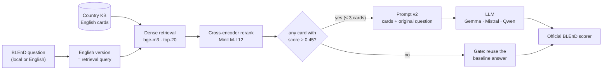

# Region-Aware RAG for Cultural Knowledge in LLMs

**An extension of [BLEnD](https://arxiv.org/abs/2406.09948) (NeurIPS 2024 Datasets & Benchmarks)**
Siddharth Rai (12342050)

LLMs know far more about everyday life in the US than in Ethiopia or Azerbaijan. On BLEnD's
short-answer questions, our baseline models score **75% for the US but 8% for Ethiopia (in Amharic)** on
the same questions. This project adds **inference-time, region-aware retrieval** (no fine-tuning) to close
that gap.

<table>
<tr>
<td align="center"><b>+20.4 pts</b><br>low-resource accuracy<br>28.3% → 48.7%</td>
<td align="center"><b>27.2 → 2.0</b><br>high- vs low-resource<br>accuracy gap (points)</td>
<td align="center"><b>12 / 12</b><br>Azerbaijan & Ethiopia settings<br>improved, every model</td>
</tr>
</table>

---

## Setup

| | |
|---|---|
| **Benchmark** | BLEnD short-answer questions: 500 everyday-culture questions per country (food, sport, family, education, holidays, work) |
| **Countries** | US, Spain, South Korea (high-resource) · Azerbaijan, Ethiopia (low-resource) |
| **Settings** | 9: each non-English country is asked in its own language **and** in English |
| **Models** | Gemma 3 4B · Mistral 7B · Qwen2.5 3B, free and open-weight, run locally with Ollama (4-bit, greedy decoding) |
| **Prompts** | BLEnD's `inst-4` (direct) and `pers-3` (persona), in the question's language |
| **Metric** | BLEnD's **official** soft-exact-match scorer, used unchanged (SEM-B, averaged over the 2 prompts) |

## Method (RAG v2)



1. **Question-driven knowledge base (KB v2).** The first KB (720 institutional "evidence cards") held the
   answer for only 7–14% of questions. For Azerbaijan and Ethiopia we added **295 cards** of mainstream
   everyday facts, one or more per BLEnD *question type* ("The most popular sport in Ethiopia is…"), with
   sources and local-language terms.
2. **Retrieve → rerank → cut off.** Search only the target country's KB with BLEnD's English question:
   dense top-20 (bge-m3), then a cross-encoder relevance score, keeping at most 3 cards with score ≥ τ.
3. **Prompt v2.** *"Use it only if it directly helps; otherwise answer from your own knowledge. Never say the
   information is not provided."* The rest of the prompt is the unchanged baseline prompt.
4. **Adaptive gate.** If no card passes τ, the prompt equals the baseline prompt, so the baseline answer is
   reused (greedy decoding; no extra LLM call).

**No test-set tuning:** α (dense weight) and τ were chosen **only on the high-resource countries**
(US, Spain, South Korea), then frozen for Azerbaijan and Ethiopia.

| Hyper-parameter | Value |
|---|---|
| Dense encoder | `BAAI/bge-m3` (cosine) |
| Fusion weight α (dense) | 1.0, chosen from {0.8, 1.0} by dev recall@20 |
| Candidates → max cards K | 20 → 3 |
| Reranker | `cross-encoder/ms-marco-MiniLM-L-12-v2` |
| Relevance cut-off τ | **0.45** (best F0.5 on dev, grid 0.05–0.95) |
| Decoding | greedy, temperature 0, max 512 tokens |

<details>
<summary><b>RAG v1 (first attempt) and why it failed</b></summary>

RAG v1 used a hybrid score (0.5·BM25 + 0.5·bge-m3), always top-3, on KB v1 only. It **lowered** accuracy by
about 12 points on average. When the right card was retrieved, RAG helped a lot (Azerbaijani 26% → 51%), but
that happened for only 7–14% of questions. Otherwise the small models refused ("information not provided")
or copied wrong facts. A weight sweep also showed that BM25 hurt. These findings, together with what the
SemEval-2026 Task 7 teams reported, led to v2.
</details>

## Results

SEM-B accuracy (%), mean of 3 models × 2 prompts.

| Country | Lang. | Baseline | RAG v1 | **RAG v2** | Δ (v2 − baseline) |
|---|---|---:|---:|---:|---:|
| US | en | 74.9 | 53.5 | 73.2 | −1.7 |
| Spain | es / en | 56.3 / 50.8 | 36.8 / 34.3 | 50.0 / 44.5 | −6.3 / −6.4 |
| South Korea | ko / en | 48.0 / 47.7 | 39.2 / 35.8 | 43.7 / 42.3 | −4.3 / −5.4 |
| **Azerbaijan** | az / en | 23.6 / 47.6 | 18.0 / 30.6 | **53.3 / 65.4** | **+29.7 / +17.9** |
| **Ethiopia** | am / en | 7.9 / 34.1 | 12.3 / 23.7 | **28.0 / 48.0** | **+20.1 / +13.9** |
| High-resource avg | | 55.5 | 39.9 | 50.7 | −4.8 |
| **Low-resource avg** | | 28.3 | 21.2 | **48.7** | **+20.4** |

| Model | Baseline | RAG v1 | RAG v2 |
|---|---:|---:|---:|
| Gemma 3 4B | 43.4 | 29.1 | **51.0** |
| Mistral 7B | 50.9 | 38.4 | **55.1** |
| Qwen2.5 3B | 36.1 | 27.2 | **43.3** |

**Takeaways**

- Retrieval helps only when the KB actually contains everyday knowledge. KB coverage is the bottleneck,
  not the retriever.
- Gating and the "use only if relevant" prompt stop most of the damage from irrelevant context: refusals
  fell from 7–20% to 1–5%.
- **Honest caveats:**
  - KB v2 was written from the benchmark's question *types* after error analysis, so its gains are
    optimistic for unseen questions. With each question's own cards removed, coverage is still about
    2.5× KB v1.
  - High-resource countries, which still use KB v1, lose 1.7–6.4 points.

Full details: [report](report/midterm_report.tex) · [design and parameters](PLAN.md) ·
[how a run works](FLOW.md) · [per-setting CSV](results/comparison_baseline_rag_ragv2.csv)

## Reproduce (single machine)

```bash
pip install -r requirements.txt          # plus Java 11, Ollama and the 3 models (see requirements.txt)
set BLEND_EMBEDDER=BAAI/bge-m3
set BLEND_RERANKER=cross-encoder/ms-marco-MiniLM-L12-v2
set BLEND_AZ_STEMMER=<path to the Azerbaijani stemmer>

# 1. Baseline
python rag_pipeline/build_jobs.py --run baseline
python rag_pipeline/remote/run_ollama.py --jobs jobs/baseline.jsonl --model gemma3:4b --out results/baseline/raw/gemma3-4b.jsonl
#    (repeat for mistral:latest -> mistral-7b.jsonl and qwen2.5:3b -> qwen2.5-3b.jsonl)
python rag_pipeline/score.py --run baseline

# 2. RAG v2 (KB v2 -> retrieve + rerank + cut-off -> only prompts with cards go to the LLM -> gate -> score)
python rag_pipeline/kb_v2/build_kb_v2.py
python rag_pipeline/retrieve_v2.py
python rag_pipeline/build_jobs.py --run rag_v2 --pc-run rag_v2_pc --prompt-version v2 \
       --retrieval results/retrieval/v2_rerank_top3.jsonl --countries Azerbaijan Ethiopia
python rag_pipeline/remote/run_ollama.py --jobs jobs/rag_v2_pc.jsonl --model gemma3:4b --out results/rag_v2_pc/raw/gemma3-4b.jsonl
#    (repeat for the other two models)
python rag_pipeline/merge_gated.py --run rag_v2 --pc-run rag_v2_pc
python rag_pipeline/score.py --run rag_v2
```

In our runs, inference ran on a separate GPU workstation; `rag_pipeline/pc.py push|start|status|pull`
automates that over SSH. All model answers and per-question scores are already in `results/`.

## Repository

```
rag_pipeline/        pipeline code: jobs, LLM runner, retrieval (v1, v2), gate, official-scorer wrapper
  kb_v2/             KB v2 card sources + builder
KB_Articles/         knowledge bases: KB v1 (720 cards) + KB v2 additions (AZ 146, ET 149)
jobs/                every prompt sent to the models
results/             raw answers, per-question scores, score tables for baseline / rag / rag_v2
report/              LaTeX report
BLEnD/               original benchmark repository (data + official evaluation code)
PLAN.md · FLOW.md    design decisions and parameters · beginner-friendly pipeline walkthrough
PROMPTS.md           how the LLM coding assistant was used (key prompts)
```

**Acknowledgements:** BLEnD (Myung et al., 2024) for the data and scorer, and the SemEval-2026 Task 7
system papers (king001, CultRAG, Simorgh). Development used an LLM coding assistant (Claude Code) under my
direction; the key prompts are listed in [PROMPTS.md](PROMPTS.md).
